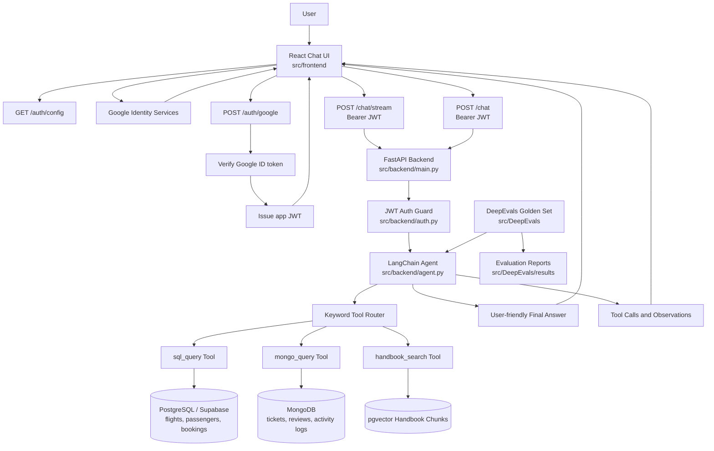

# Multi DB React Agent

Multi DB React Agent is a full-stack AI assistant demo for SkyNova Airlines. It uses a React chat UI, a FastAPI backend, Google sign-in with JWT sessions, and a LangChain agent that can route questions across PostgreSQL, MongoDB, and a handbook RAG search.

The app is designed to show the full agent loop: user question, tool routing, tool call trace, observations, and final answer.

## Features

- Vite + React + TypeScript chat UI
- FastAPI backend serving both API endpoints and the built frontend
- Google Identity sign-in with backend-issued JWT
- Streaming chat endpoint with visible agent events
- Tool call trace showing tool name, arguments, and returned observation
- PostgreSQL tool for flights, passengers, and bookings
- MongoDB tool for support tickets, reviews, and activity logs
- RAG tool for SkyNova handbook policy questions
- DeepEvals-style golden set runner for regression checks
- Safety controls for SQL and MongoDB tool execution

## Architecture



## Project Layout

```text
.
|-- src
|   |-- backend
|   |   |-- agent.py              # LangChain agent, routing, streaming event adapter
|   |   |-- auth.py               # Google token verification and JWT helpers
|   |   |-- main.py               # FastAPI app, auth routes, chat routes, frontend serving
|   |   |-- db
|   |   |   |-- mongo.py          # MongoDB connection
|   |   |   `-- postgres.py       # PostgreSQL connection
|   |   `-- tools
|   |       |-- sql_tool.py       # SQL generation, validation, LIMIT, timeout
|   |       |-- mongo_tool.py     # Mongo query generation, whitelist, safety checks
|   |       `-- rag_tool.py       # Handbook vector search
|   |-- data                       # Seed/load helpers and handbook data
|   |-- DeepEvals                  # Golden cases and eval runner
|   |-- frontend                   # Vite + React + TypeScript UI
|   |-- .env.example
|   `-- .env                       # Local secrets, ignored by git
|-- tests
|-- pyproject.toml
`-- README.md
```

## Environment Variables

Create `src/.env` from `src/.env.example`.

```env
OPENAI_API_KEY=
SUPABASE_URI=
MONGO_URI=
GOOGLE_CLIENT_ID=
JWT_SECRET_KEY=
JWT_EXPIRE_MINUTES=60
```

Notes:

- `GOOGLE_CLIENT_ID` comes from the Google Cloud OAuth client.
- `JWT_SECRET_KEY` is your app's own signing secret. Do not use the Google client secret for this.
- `src/.env` should not be committed.

## Local Setup

Install backend dependencies:

```powershell
uv sync
```

Install frontend dependencies:

```powershell
cd src/frontend
npm install
```

Build the frontend so FastAPI can serve it:

```powershell
cd src/frontend
npm run build
```

Run the combined backend and frontend app:

```powershell
cd ../backend
uv run uvicorn main:app --reload --port 8001
```

Open:

```text
http://127.0.0.1:8001
```

If port `8001` is busy, use another port:

```powershell
uv run uvicorn main:app --reload --port 8010
```

## Google Authentication Flow

1. The React app requests `/auth/config` to get the configured Google client ID.
2. Google Identity Services renders the sign-in button in the browser.
3. After a successful Google sign-in, Google returns an ID token to the frontend.
4. The frontend sends that token to `POST /auth/google`.
5. The backend verifies the Google ID token using `google-auth`.
6. The backend creates its own JWT for this app.
7. The frontend stores the JWT in local storage.
8. Chat requests include `Authorization: Bearer <token>`.
9. FastAPI protects `/chat`, `/chat/stream`, and `/auth/me` using the JWT guard.

## Chat API

### Streaming Chat

```http
POST /chat/stream
Authorization: Bearer <jwt>
Content-Type: application/json
```

```json
{
  "question": "Show me recently cancelled flights"
}
```

The response is Server-Sent Events with agent progress, tool actions, observations, final answer, and done events.

### Non-Streaming Chat

```http
POST /chat
Authorization: Bearer <jwt>
Content-Type: application/json
```

```json
{
  "question": "What is the baggage policy?"
}
```

Response shape:

```json
{
  "answer": "Final answer for the user",
  "tool_calls": [
    {
      "tool": "handbook_search",
      "input": "...",
      "output": "..."
    }
  ],
  "warnings": [],
  "elapsed_ms": 1234
}
```

## Agent Tooling

The agent has three tools:

- `sql_query`: PostgreSQL questions about flights, passengers, and bookings.
- `mongo_query`: MongoDB questions about support tickets, flight reviews, and user activity logs.
- `handbook_search`: RAG search for SkyNova policy and handbook questions.

The router narrows the available tools based on the question. If a question spans multiple data sources, the agent can use multiple tools and combine the observations.

## Safety Controls

SQL tool:

- Allows only `SELECT` queries.
- Blocks destructive SQL keywords.
- Auto-injects `LIMIT 20` when missing, except count-style queries.
- Uses a PostgreSQL statement timeout.
- Limits returned rows in the final tool payload.

MongoDB tool:

- Uses a collection whitelist.
- Caps result count with `.limit(20)`.
- Blocks server-side JavaScript operators such as `$where`, `$function`, and `$accumulator`.
- Rejects unrecognized MongoDB operators.

## DeepEvals Golden Set

Run the golden set:

```powershell
uv run python src/DeepEvals/run_golden_eval.py
```

Run a quick smoke eval:

```powershell
uv run python src/DeepEvals/run_golden_eval.py --limit 3
```

Reports are written to:

```text
src/DeepEvals/results/latest_eval_results.json
src/DeepEvals/results/eval_results_YYYYMMDD_HHMMSS.json
```

The golden set checks core behavior such as tool routing, answer keywords, mixed-source questions, and safety expectations.

## Tests

Run the Python test suite:

```powershell
uv run python -m unittest discover -s tests -v
```

Build the frontend:

```powershell
cd src/frontend
npm run build
```

## Deployment Notes

Deployed app:

```text
https://multi-db-react-agent-259390522728.us-central1.run.app
```

The project is arranged so the frontend and backend can be deployed together:

1. Build the React frontend with `npm run build`.
2. FastAPI serves the generated `src/frontend/dist` folder.
3. Deploy the FastAPI app as the single web service.
4. Configure production environment variables in the deployment platform.
5. Add the deployed URL to the authorized origins in Google Cloud Console.

## Demo Questions

Try questions like:

- "Show me recently cancelled flights."
- "Which support tickets are high priority?"
- "What is the refund policy for cancelled flights?"
- "Find low-rated flight reviews and summarize the issue."
- "Show delayed flights and tell me the compensation policy."

## Tech Stack

- Python 3.11+
- FastAPI
- LangChain
- OpenAI
- PostgreSQL / Supabase
- pgvector
- MongoDB
- React 19
- Vite
- TypeScript
- Google Identity Services
- JWT
